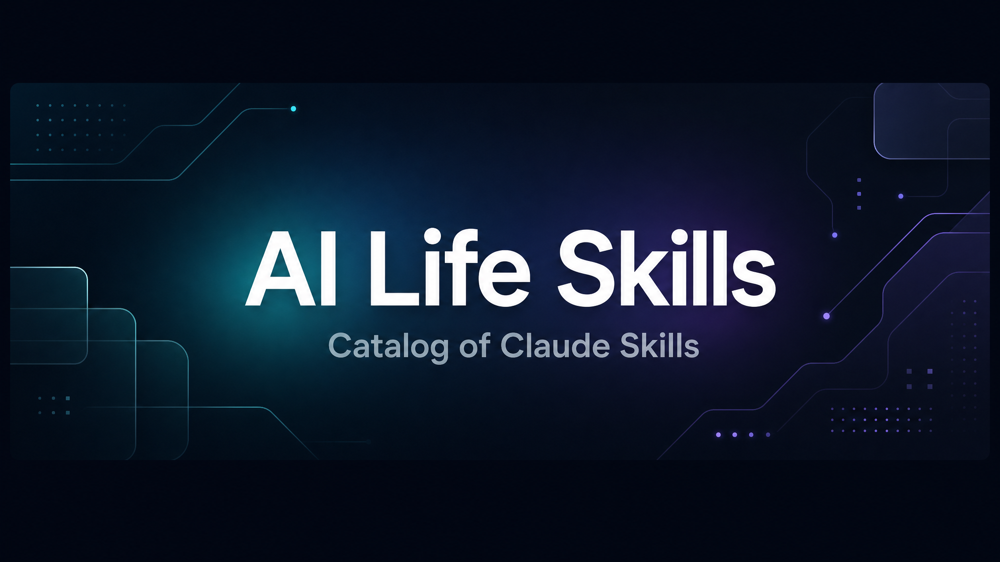

# AI Life Skills

Catalog of Claude Skills I like, organized by category.

## Intake flow

1. Read the user paste for: skill name, official URL, source/repo URL, what it does, when to use it, and trigger phrases.
2. If a field is missing, infer it only when the text makes it obvious.
3. If a missing field blocks a correct catalog row, ask one question.
4. Update the index row and the detailed note together.
5. Report back with what was written and what was inferred.

## ✨ Featured

_None yet._

## 🎨 Design

| Skill | What it does | When to use | Official URL | Note file |
|---|---|---|---|---|
| ui-ux-pro-max-skill | Design-intelligence skill for professional UI/UX and design-system generation across multiple platforms. | UI design, landing pages, design systems, frontend styling decisions. | https://github.com/nextlevelbuilder/ui-ux-pro-max-skill | `skills/ui-ux-pro-max-skill.md` |
| impeccable-style | Frontend design-intelligence skill with 23 commands, live mode, and design-system guidance. | UI styling, design systems, audits, optimization, and page-specific design prompts. | https://impeccable.style/ | `skills/impeccable-style.md` |

## 🛠️ Tech

| Skill | What it does | When to use | Official URL | Note file |
|---|---|---|---|---|
| context-mode | MCP server for keeping large tool output out of context and preserving session continuity. | Large logs/JSON, long agent sessions, context blowups, multi-tool coding workflows. | https://context-mode.com/ | `skills/context-mode.md` |
| claude-mem | Claude Code plugin for persistent memory across sessions and context retrieval. | Cross-session memory, project history, and keeping prior work available. | https://docs.claude-mem.ai/ | `skills/claude-mem.md` |
| here-now | Instant web hosting and file storage for agents; publishes static sites to live URLs and stores private files in Drive. | Publishing websites, prototypes, docs, dashboards, static assets, or agent files that need a URL. | https://here.now/ | `skills/here-now.md` |

## 🧩 Other

_None yet._

## Conventions

- Use a stable lowercase hyphenated skill name for files.
- Keep each row short.
- Put deeper notes in the per-skill MD file.
- If a detail is inferred, mark it as inferred in the note file.
- See `skills/README.md` for note-file conventions and `skills/_template.md` for the starter layout.
